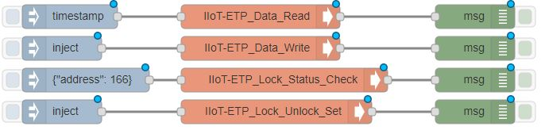

# node-red-contrib-atgpio
A collection of [Node-RED](http://nodered.org) nodes to Configure ADVANTECH GPIO driver.

## Install
Use npm to command to install this package locally in the Node-RED modules directory
```bash
npm install node-red-contrib-atgpio
```
or install in it globally with the command
```bash
npm install node-red-contrib-atgpio -g
```
## Nodes included in the package
**GPIO Info :** GPIO information node. Generates a _msg.payload_ in JSON format including Pin number, Mode(In/Out), Value(High/Low) of each GPIO pin.

**GPIO input :** GPIO input node. Set the selected GPIO pin to input and then read the value from it.

**GPIO output :** GPIO output node. Set the selected GPIO pin to output and then write a value to it.

### Example
  
Please refer to `demo.json` for more detail.

## Tested Platform
- Windows 10 Enterprice LTSB

## History
- 1.0.4 - October 2017 : Initial Release

## License
Copyright 2017 ADVANTECH Corp. under [the Apache 2.0 license](LICENSE).